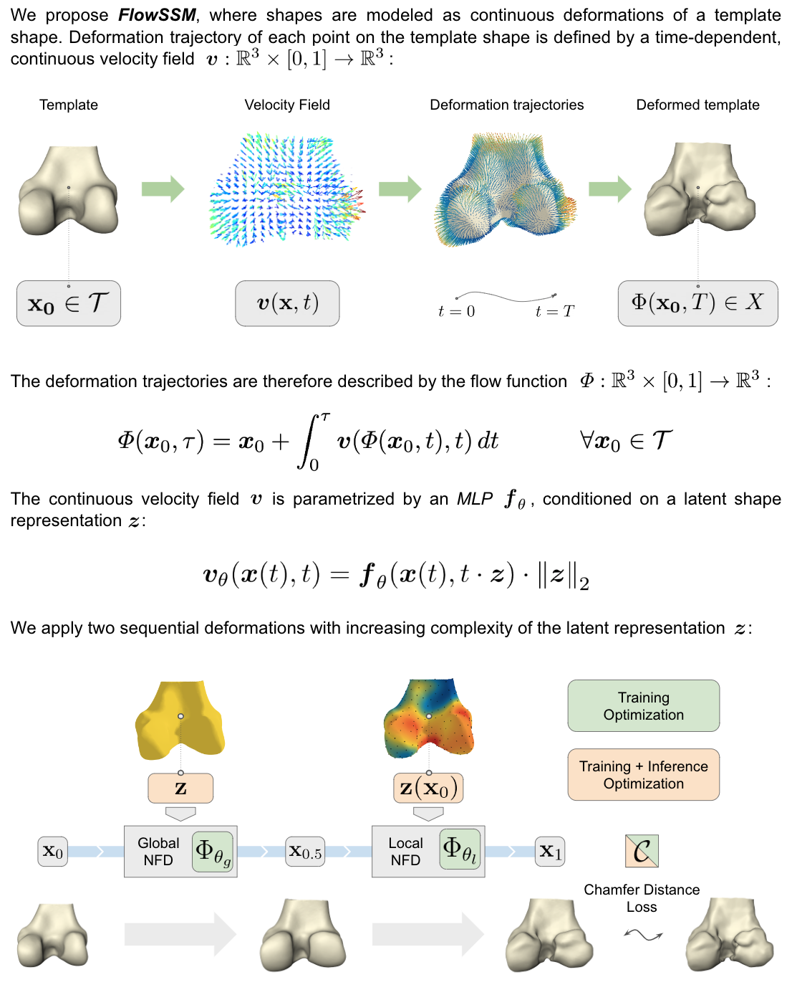

# Landmark-free Statistical Shape Modeling via Neural Flow Deformations

This repository provides the original implementation of our MICCAI 2022 paper "[Landmark-free Statistical Shape Modeling via Neural Flow Deformations](https://arxiv.org/abs/2209.06861)".





If you use our work, please cite:

```
@inproceedings{10.1007/978-3-031-16434-7_44,
  title={Landmark-free Statistical Shape Modeling via Neural Flow Deformations},
  author={L{\"u}dke, David and Amiranashvili, Tamaz and Ambellan, Felix and Ezhov, Ivan and Menze, Bjoern H. and Zachow, Stefan},
  booktitle={Medical Image Computing and Computer Assisted Intervention -- MICCAI 2022},
  pages={453--463},
  year={2022},
  publisher={Springer Nature Switzerland}
}
```

### Requirements

This implementation requires PyTorch, PyTorch3d and torchdiffeq as the main installations.
Please set-up a new virtual environment and install pytorch (pytorch3d) as well as the additional requirements from [requirements.txt](/setup/requirements.txt):

```
# Install pytorch
pip3 install torch==1.11.0+cu<cuda-version> torchvision==0.12.0+cu<cuda-version> torchaudio==0.11.0 --extra-index-url https://download.pytorch.org/whl/cu<cuda-version>

# Install pytorch3D
pip3 install --no-index --no-cache-dir pytorch3d -f https://dl.fbaipublicfiles.com/pytorch3d/packaging/wheels/py<python-version>_cu<cuda-version>_pyt<pytorch-version>/download.html

# Install other dependencies
pip3 install -r setup/requirements.txt 
```

Note: The code has been run and tested on linux with python 3.8 and Cuda 11.3. 
To install the right PyTorch version with cuda might require a different installation.
Especially PyTorch3d can be tricky to install, depending on the OS, pytorch and cuda version [help to be found here](https://github.com/facebookresearch/pytorch3d/blob/main/INSTALL.md).

### Data

Shapes are to be in .ply format and organised into train, val and test directories, with a mean.ply template.
For a reconstruction experiment shapes can be generated with [make_reconstruction_data.py](utils/make_reconstruction_data.py).
Classification labels are to be presented in a dictionary with the case id's as keys and labels as values.


### Template generation

Learning hub representations of the training shapes via shapeflows hub and spokes mehtod is configured and run via a shell script:
```
sh generate_template.sh
```


### Training

The training is configured and run via a shell script:
```
sh train.sh
```

### Run model on test or validation data

Fitting the model to unseen data (test, validation) and sampling shapes for the specificity experiment is configured and run via a shell script:
```
sh eval.sh
```

### Evaluate surface distance of generality and specificity data

Computing the surface distances and number of self-intersections for generality and specificity data is configured and run via a shell script:
```
sh compute_distances.sh
```

### Fit reconstruction shapes

Fitting the model to partial and sparse data and generating reconstructions is configured and run via a shell script:
```
sh reconstruction.sh
```

### Classification

The classification functions can be found [here](utils/classifier.py).

### Tune epsilon and number of gridpoints for dataset

Tuning hyperparameter based on a pretrained model is configured and run via a shell script:
```
sh tune.sh
```

### Third party code

Parts of the code are used from other repositories:
* Part of [shapeflow](https://github.com/maxjiang93/ShapeFlow) is used to compute a template shape. The used layers can be found [here](shapeflow).
